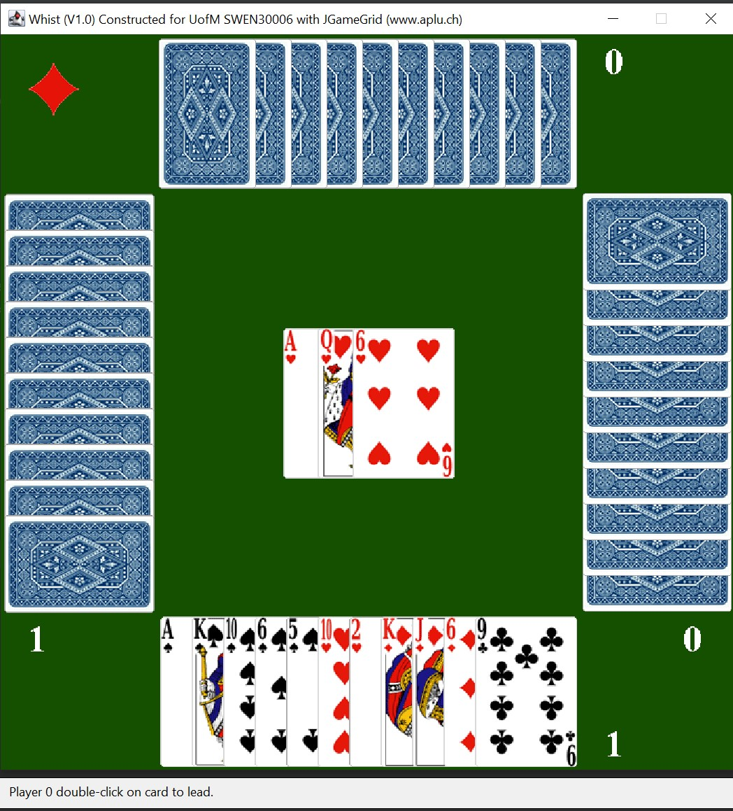

# whist

## About
This is a practice project that improves my understanding of Java Programming, Object-oriented Programming, Software Design, Java Design Patterns and Team Work. 
It aims to write a [_**whist game**_](https://en.wikipedia.org/wiki/Whist) based on a framework called [_**JCardGame**_](https://www.aplu.ch/home/apluhomex.jsp?site=91). 
In the game, each player can be a human player, smart computer, naive computer or fool computer. There are **Design Analysis** and **Static Design Diagram** available to view in the report folder.

## Features
* Customise game configurations. The administrator can set up the number of cards, winning condition, level of intelligence of computer player, initial seed & if the game rule is enforced.
* Number of Java Design Patterns used, including Strategy pattern, Observer Pattern, Singleton Pattern & Factory Pattern.
* Maximised cohesion and minimised coupling.

## Running Locally
### Prerequisite
IntelliJ/Eclipse

### Start The Game
1. navigate to the folder of whist, right-click the folder & select < open folder as IntelliJ project >.
2. Click the < file > button located at the top left of the window, then select < Project Structure > from the drop-down menu.
3. In the popup window, choose SDK version 15, language level < 15 - text block >, then apply and click OK.  
(Avoiding the bug that may appear from using versions 16 & 17)
4. Double-check if < JGameGrid > library is added in the project by selecting <Libraries> from the left panel of the window.
5. Run the game either from the <Run> button at the top of the window, or find the < main > method in Whist class and run from there
6. You can config the game in the < .PROPERTIES > file, there are a few config files that already exist in the repo. 
The filename of the config file needs to be changed to < whist > to be effective.  

## Addition Informations
### Static Design Diagram

### Gamebaord

